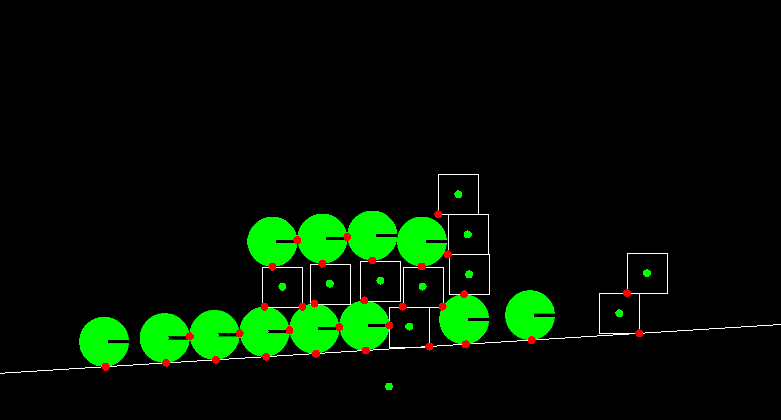

# Physics
 
This is a rigid body physics simulator I made many years ago. It was the first time I've had to deal with basic computational geometry problems, like detecting if two objects intersect. Unfortunately I didn't manage to get objects to rotate correctly by the time I moved on from this project.

The demo is a Java Applet. To try the demo, left click to create a circle and right click to create a square.

